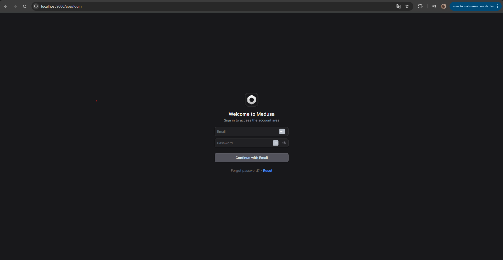
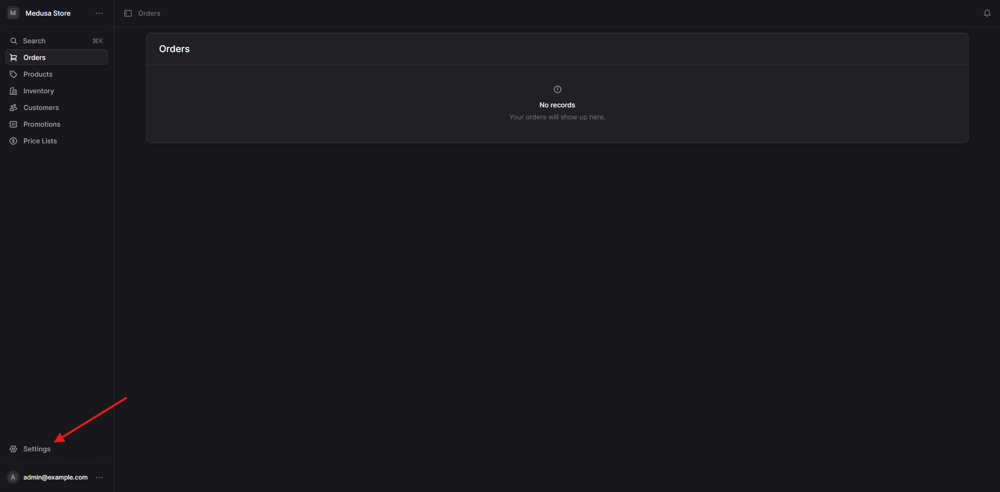
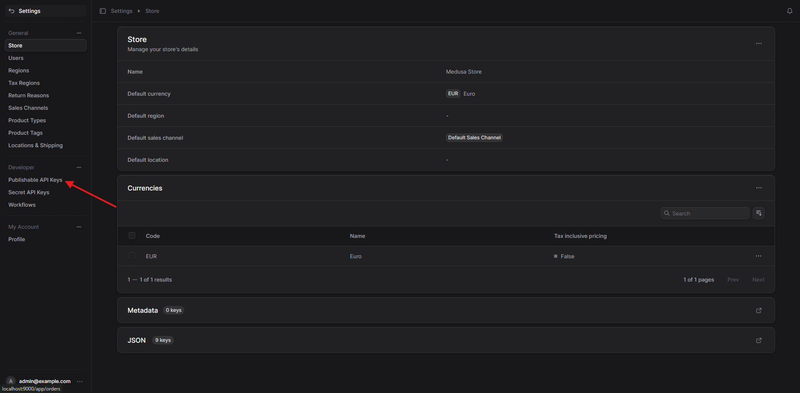
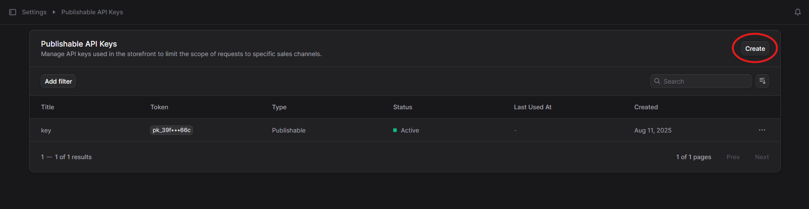
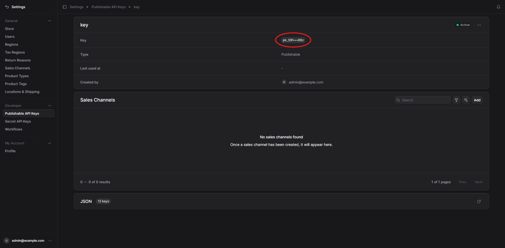
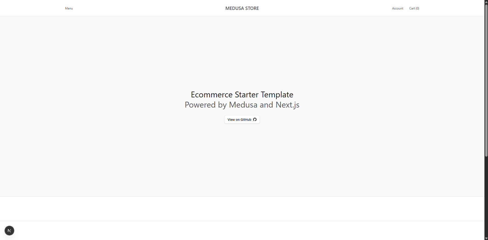
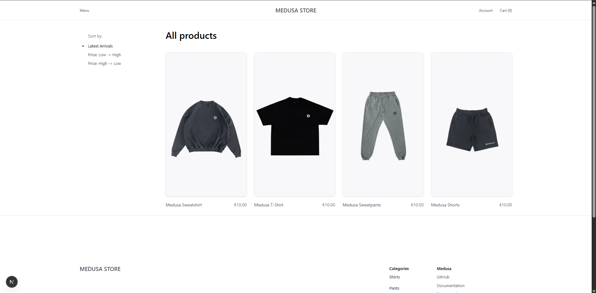

## Overview

One-command dev environment for Medusa v2 backend and a Next.js storefront using Docker Compose.

Services:
- PostgreSQL (5432)
- Redis (6379)
- Medusa backend (9000)
- Next.js storefront (8000)

## Prerequisites
- Docker and Docker Compose v2
	- Windows/macOS: Docker Desktop includes Compose v2
	- Linux: Docker Engine + docker-compose-plugin (Compose v2)
- Node 20+ installed locally only if you run apps outside Docker (optional)

## Setup
This repo ships with empty backend/ and storefront/ folders on purpose. Use the bootstrap scripts to scaffold a fresh Medusa storefront and apply our Docker/config patches.

1) Copy env template and customize (the bootstrap scripts will do this automatically):
```powershell
Copy-Item .env.template .env
```

2) Bootstrap the apps to populate storefront/ and apply patches to both apps

Windows (cmd)
```bat
:: default Medusa starter
scripts\bootstrap.bat

:: configure via .env (STOREFRONT_REPO/STOREFRONT_REF, BACKEND_REPO/REF, dirs) and re-run
```

macOS/Linux (Bash)
```bash
# default Medusa starter
./scripts/bootstrap.sh

# custom storefront repo and branch/tag
STOREFRONT_REPO="https://github.com/your-org/your-nextjs-storefront" \
STOREFRONT_REF="main" \
./scripts/bootstrap.sh
# alternatively, set STOREFRONT_REPO/STOREFRONT_REF in .env and just run ./scripts/bootstrap.sh
```

What the bootstrap does
- Clones the storefront into storefront/ (resets that folder)
- Sets up the backend in backend/ by either:
	- Cloning the official medusa-starter-default repo (default), or
	- Running the create-medusa-app tool if BACKEND_REPO is unset
- Copies our patches from patch/storefront into storefront/
- Creates .env from .env.template at the repo root if missing

Important: generate a publishable API key
- On first visit to http://localhost:8000 you will likely see: "Error: A valid publishable key is required to proceed with the request" — this is expected until you create and configure a key.
- Create at least one Region and Sales Channel in your Medusa backend.
- Create an admin user (if you don't have one yet) and sign in to the Admin to generate a key:

	Windows PowerShell
	```powershell
	docker exec -it medusa_backend sh -lc "export NODE_ENV=production && npx medusa user --email admin@example.com --password 'test1234'"
	```

- In the Admin panel, generate a Publishable API Key for your Sales Channel, then set it in your `.env` as `NEXT_PUBLIC_MEDUSA_PUBLISHABLE_KEY`.
- Apply the change by recreating containers:

	Windows PowerShell
	```powershell
	docker compose up -d
	```

- Without this key, most dynamic storefront pages will return empty data.

Step-by-step with screenshots

1) Log in to the Admin at http://localhost:9000/app

	

2) Go to Settings

	

3) Open Publishable Keys

	

4) If a "Webshop" key already exists, click to copy it and use that key. Otherwise, create a new key.

	

5) Click the key to copy it and paste into your .env as `NEXT_PUBLIC_MEDUSA_PUBLISHABLE_KEY`.

	

Key vars:
- Database: POSTGRES_DB, POSTGRES_USER, POSTGRES_PASSWORD
- Backend: JWT_SECRET, COOKIE_SECRET, STORE_CORS, ADMIN_CORS, AUTH_CORS
- Storefront (browser): NEXT_PUBLIC_MEDUSA_BACKEND_URL (defaults to http://localhost:9000)
- Storefront (server/SSR/middleware): MEDUSA_INTERNAL_BACKEND_URL is injected by docker-compose (http://medusa:9000). Do not set MEDUSA_BACKEND_URL in .env.
- Optional: NEXT_PUBLIC_MEDUSA_PUBLISHABLE_KEY (required for dynamic pages hitting the backend in the browser)
- Misc: NODE_ENV (development|production), SEED_DB (false by default)

Bootstrap configuration in .env (optional):
- STOREFRONT_REPO: Git URL for the storefront to clone (defaults to Medusa starter)
- STOREFRONT_REF: Branch/tag to checkout (defaults to main)
- BACKEND_DIR, STOREFRONT_DIR: target folders (default backend, storefront)
- BACKEND_REPO, BACKEND_REF: backend starter repo and branch to clone (defaults to medusa-starter-default@master)
- BACKEND_INIT_CMD: fallback command template to initialize the backend when BACKEND_REPO is unset (default uses npx create-medusa-app@latest {dir})

## Run
```powershell
docker compose up --build
```

Open:
- Backend health: http://localhost:9000/health
- Admin panel: http://localhost:9000/app
- Storefront: http://localhost:8000

Note on first run: the storefront needs 1–2 minutes to warm up (install/build) on initial boot. During this time, requests may return empty data even if the backend is healthy. Give it a minute and check container logs before debugging.

Storefront preview





## Helper scripts (Windows/macOS/Linux)
- Windows (cmd)
	- docker-up.bat [--rebuild]
	- docker-down.bat [--prune]
	- docker-restart.bat
- Bash
	- ./docker-up.sh [--rebuild]
	- ./docker-down.sh [--prune]
	- ./docker-restart.sh

Apply patches only (if you already have apps):

- Windows (cmd)
```bat
scripts\apply-patches.bat
```

- macOS/Linux
```bash
./scripts/apply-patches.sh
```

## CI/CD
Single smoke test workflow ensures Docker stack boots and responds:
- .github/workflows/compose-smoke.yml
	- Creates a minimal .env for the runner
	- Builds and starts docker compose
	- Waits for backend /health (http://localhost:9000/health)
	- Pings storefront static asset (http://localhost:8000/favicon.ico) to bypass middleware and publishable key
	- Dumps logs on failure and tears down

Dependabot is kept for automated dependency checks.

## Production notes
- For production, run the backend with NODE_ENV=production to build and start the compiled server.
- Consider a multi-stage Dockerfile for the storefront to prebuild and serve with next start.
- Use strong JWT_SECRET and COOKIE_SECRET; set publishable keys via secrets.

## Troubleshooting
- Script perms inside containers: backend startup normalizes CRLF and chmod +x start.sh.
- Port conflicts: change published ports in docker-compose.yml.
- Admin redirecting to medusa:9000: remove MEDUSA_BACKEND_URL from .env; the browser must use NEXT_PUBLIC_MEDUSA_BACKEND_URL (localhost). Internal networking is handled via MEDUSA_INTERNAL_BACKEND_URL in docker-compose.
- Storefront empty data: add at least one Region and link it to a Sales Channel; set NEXT_PUBLIC_MEDUSA_PUBLISHABLE_KEY with access to that channel.
- Storefront first run is slow: the initial Next.js build can take 1–2 minutes; until then, some pages return empty data. Wait for the storefront logs to show it’s ready.
- CI missing .env: the smoke workflow creates it automatically; if running manually, create .env first.
- Backend build fails copying package-lock.json: Our backend Dockerfile now copies the full context and installs based on the detected lockfile (npm/yarn/pnpm). Ensure the backend directory contains a package.json and one of the lockfiles.
- Backend init E404: If you see an npm 404 for @medusajs/create-medusa-app, use the unscoped package. The default BACKEND_INIT_CMD uses "npx create-medusa-app@latest {dir}".

## Repo layout notes
- backend/ and storefront/ are initially empty; the bootstrap will populate them.
- Our Dockerfiles and config live under patch/backend and patch/storefront and are applied on top of upstream starters. This keeps upgrades simple.

## Contributing
- Keep env secrets out of the repo (.env is gitignored).
- Prefer small PRs and include a brief description and testing notes.
